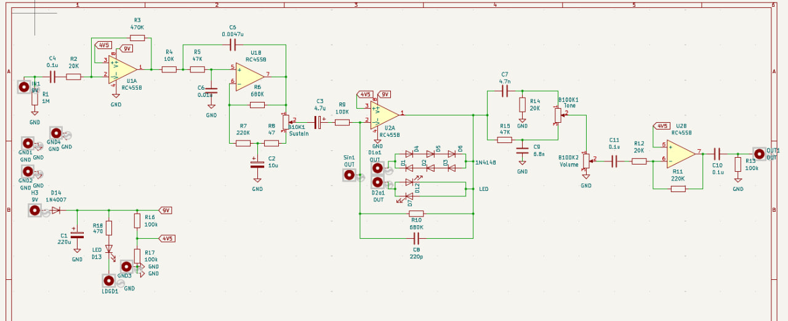
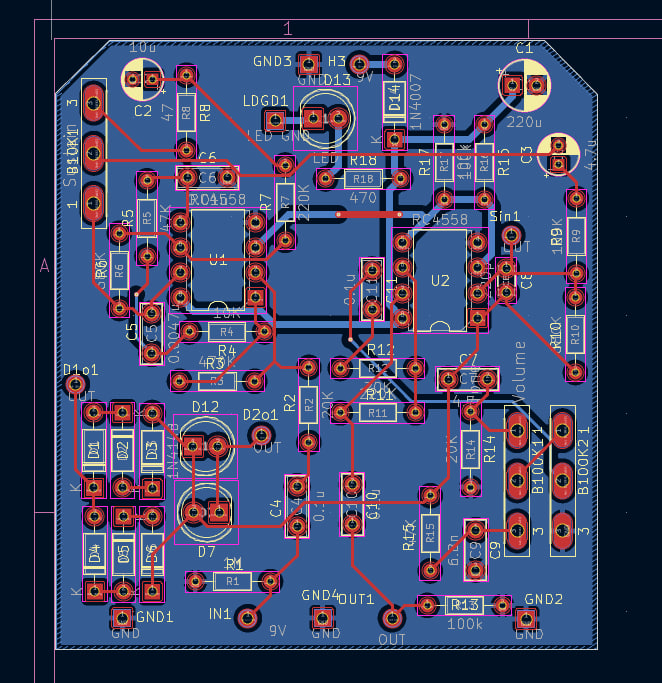
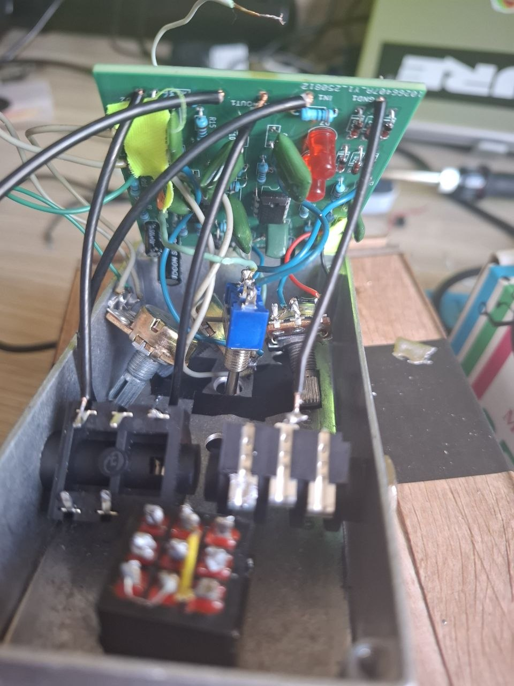
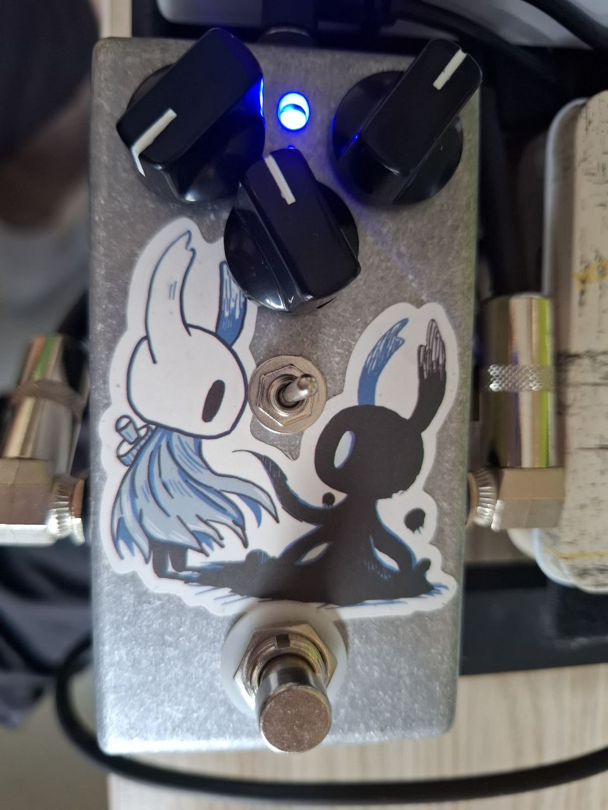

# Fuzz
This is my custom-designed fuzz pedal for electric guitar

## Features
- 2 modes for diodes
- Extra volume gain stage
- True Bypass

## Schematic

## Parts Used
| Component         | Value   | Qty |
| ----------------- | ------- | --- |
| B10K1             | Sustain | 1   |
| B100K1            | Tone    | 1   |
| B100K2            | Volume  | 1   |
| C1                | 220u    | 1   |
| C2                | 10u     | 1   |
| C3                | 4.7u    | 1   |
| C4,C10,C11        | 0.1u    | 3   |
| C5                | 0.0047u | 1   |
| C6                | 0.01u   | 1   |
| C7                | 4.7n    | 1   |
| C8                | 220p    | 1   |
| C9                | 6.8n    | 1   |
| D1,D2,D3,D4,D5,D6 | 1N4148  | 6   |
| D7,D12,D13        | LED     | 3   |
| D14               | 1N4007  | 1   |
| R1                | 1M      | 1   |
| R2,R12,R14        | 20K     | 3   |
| R3                | 470K    | 1   |
| R4                | 10K     | 1   |
| R5,R15            | 47K     | 2   |
| R6,R10            | 680K    | 2   |
| R7,R11            | 220K    | 2   |
| R8                | 47      | 1   |
| R9                | 100K    | 1   |
| R13,R16,R17       | 100K    | 3   |
| R18               | 470     | 1   |
| U1,U2             | RC4558  | 2   |

## Build Process
1. The original schematic of OP-AMP BIG MUFF was learnt and used as a beginning reference.
   

   This time, my goal was to test and build from scratch something similar to big-muff fuzz for my own pedal collection. In addition, it was planned to print own PCB for this project. Due to some reviews telling that it is relatively quite pedal, the usage of extra op-amp was decided to increase the overall volume of the pedal. The original had a single 4558 op-amp and 1 LM741, however after some comparison it was found that 4558 is basically a double version for LM741. Therefore, 2 pieces of 4558 were used. 
   
2. After testing the circuits, the PCB design was prepared in KiCAD. Due to the fact that this was the first time i build PCB, it was redesigned a little bit in the future. Anyway, the pedal eventually worked as it should had.
   

3. After designing and ordering the PCB, it was assembled and tested.
   

As a conculsion, the pedal was pretty similar to the original op-amp big-muff. Some notices, the gain on the last stage was much greater than it was desired, therefore future replacement of R20 should be considered to reduce the gain. It was also found that more gain on sustain stage would be more preferable for more compressed sound.

## License
MIT License — free to use for personal/non-commercial projects.
---

© 2026 Daniil Khichshenko
